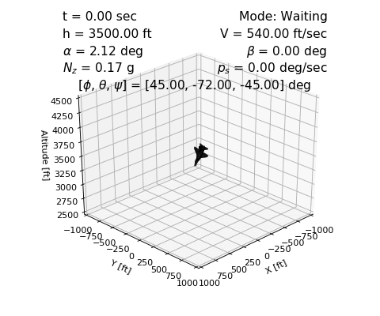


  

# AeroBenchVVPython Overview
This project contains a python version of models and controllers that test automated aircraft maneuvers by performing simulations. The hope is to provide a benchmark to motivate better verification and analysis methods, working beyond models based on Dubin's car dynamics, towards the sorts of models used in aerospace engineering. Compared to actual aerospace models used in practice, however, these models are still very simple. Roughly speaking, the dynamics are nonlinear, have about 10-20 dimensions (continuous state variables), and hybrid in the sense of discontinuous ODEs, but not with jumps in the state. 

This is a python port of the original matlab version, which can can see for
more information: https://github.com/pheidlauf/AeroBenchVV

### Release Documentation
Distribution A: Approved for Public Release (88ABW-2017-6379)
